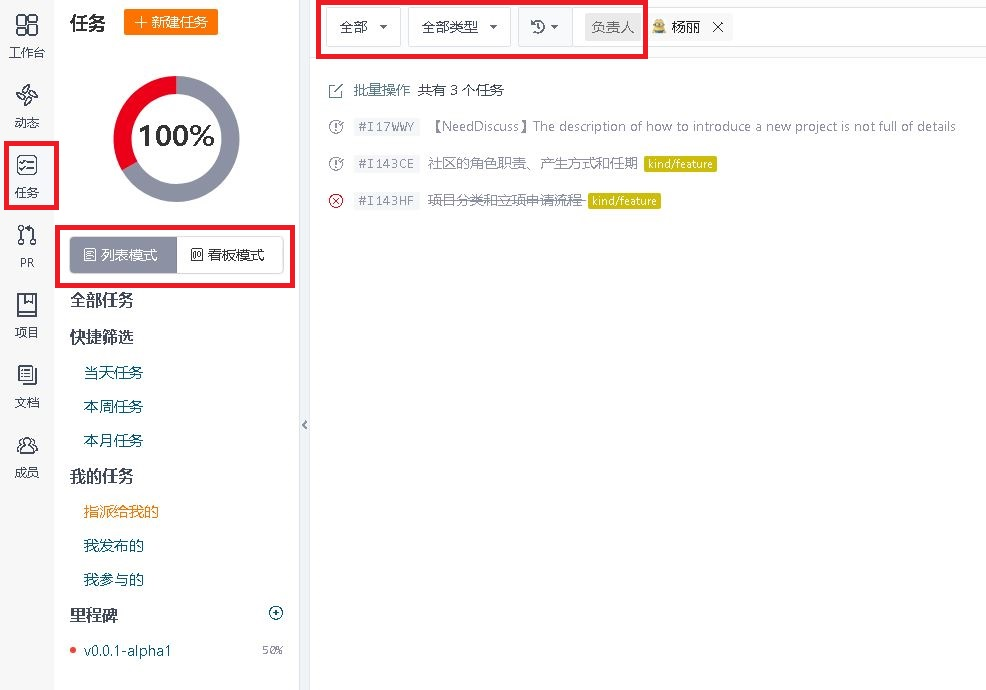
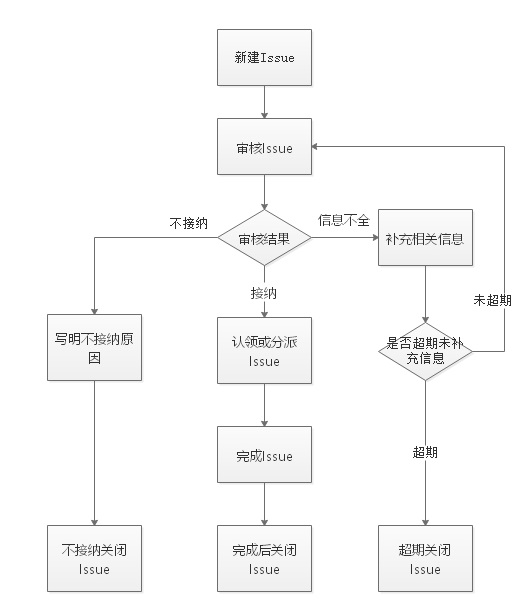
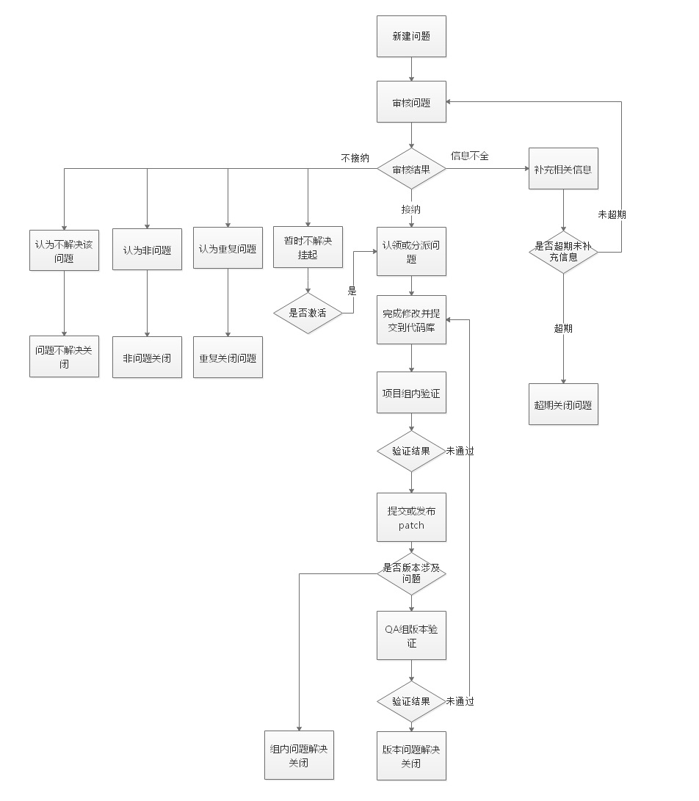

# Issue提交指南

目录：

- Issue简介
- Issue的基本功能
- Issue的全局视图
- 需求类Issue提交和处理指导
- bug类Issue提交和处理指导
- 安全类Issue提交和处理指导


##  Issue简介

- **名词解释**：Issue是指一项待完成的工作，这个工作可以是“问题”、“事务”、“需求“和”建议“等。每一个Issue都包含该工作的所有信息和历史，便于后来的人了解该项工作的所有方面和过程。

- **来源和作用**：Issue的概念起源于客服部门，用户打电话反馈问题，客服就创建一个工单（ticket），后继每一个处理步骤、每一次和用户的交流都要更新到工单内，记录全部的过程信息，这就是Issue的前身。随着后来的不断扩展，逐步演变成制定和实施软件开发计划的全功能项目管理工具。

- openEuler社区直接使用Gitee提供的Issue跟踪和管理系统。


## Issue的基本功能

- Gitee的每一个Repository内都有一个Issue面板


- 进入该面板，点击“+新建Issue”，就可以新建一个Issue，如下图所示。


- 左侧填入Issue的标题和内容，右侧是几个配置项。下面简单介绍这些配置项的用法。
  - 负责人：用于从当前repository的所有成员内指派对该Issue的处理人员，包括负责人和协作者。
  - 标签：可以给该Issue贴上标签，便于对Issue进行分类管理和过滤筛选。
  - 项目：可以给该Issue关联项目。只有SIG成员才有新增项目权限
  - 里程碑：相关的Issue可以放到一个里程碑里。里程碑通常可以理解为不同的版本或不同的迭代。
  - 关联分支：可以指明Issue针对的是哪个分支
  - 计划开始/截止日期：可以给该Issue指明期望的计划开始和截止日期，便于领取任务的人参考。
  - 置顶选项：可以选择是否让该Issue放置到Issue列表的顶部，以便于吸引大家的关注。
  - 优先级：可以给Issue置顶优先级。


## Issue的全局视图

Issue面板只能查看和操作当前的repository，Gitee还提供了Issue的全局视图。

- **组织的全局视图**：您可以在openEuler组织下直接点击Issue面板看到该组织下的所有Issue。

  

- **个人的全局视图**：点击组织的全局视图内的任何一个Issue，您就进入了**“个人工作台“**界面。点击左侧的”任务“，您就可以查看和操作所有和您相关的Issue。您可以选择两种显示模式，也可以在工具栏按不同的条件进行筛选、过滤和排序。

  
  
  


## 需求类Issue提交和处理指导

完整的需求类Issue处理流程，请参考下面的流程图



**step1：新建需求类Issue**（Issue状态：待办的）

- 请进入需求对应的团队或项目的repository内（如何找到对应的repository请参考[此章节内容](README.md/#id2-1-2)），进入Issue面板，点击“新建Issue”。

- 如果您不确定该需求对应的团队或项目，请在[community-issue](https://gitee.com/openeuler/community-issue)中创建，会有社区的开发者帮助进行归属等信息的确认。

- 请在标题栏的单选下拉框将Issue类型设置成“需求”，系统会自动为您调出需求模板

- 请在标题栏**简要描述需求的要点**

- 请在详细说明框内说明需求的场景和价值。

*请注意：清晰完整的描述有助于团队成员理解，并被更快的接受和排入开发计划。*

**step2：团队成员审核Issue**（Issue状态——通过：进行中 *或者*  补充信息： 待办的 *或者* 拒绝：已拒绝 ）

- **step2.1**：审核后接纳

  团队成员（maintainer或者committer）审核后认为可以接纳该需求，则由审核人补充接纳需求的相关信息，并包含：

  - 检查并设置该需求所属的项目
  - 设置该需求建议合入的里程碑信息（规划版本信息）
  - 设置该需求的优先级标签，请在标签栏选择“feature:High”、“feature:Medium”或者"feature:Low"
  - 完成以上的信息以后，请将该Issue的“当前状态”调整成“进行中”（**进入step3**）

- **step2.2**：描述不清晰挂起

  团队成员审核后认为描述的信息不清晰，可以在该Issue的评论区留言或在邮件列表中讨论，让提交人继续补充相关信息。
  
- **step2.2.1**：如果在一个月内提交人未及时补充相关信息，则系统会自动关闭该问题（**跳到step4**）
  - **step2.2.2**：Issue提交人补充信息后，可以通过评论让团队成员审核（**跳到step2**）。
  
  **step2.3**：审核后不接纳
  
  团队成员审核后，由于需求价值不高等原因认为暂不接纳，可以在评论区留言或在邮件列表中讨论说明原因。确认后将Issue的“当前状态”调整成“已拒绝”（**跳到step4**）

**step3：认领或分派Issue**（Issue状态：开启的） 

已经进入开发阶段的需求，可以主动认领，也可以由团队成员分配。您可以在评论框内输入`/assign`来把Issue分配给自己，或分配给其他人。

**step4：关闭Issue**，关闭Issue有三种情况：

- 需求完成后关闭，可以由认领人手工修改状态，也可以通过关联PR后，由PR审核通过后系统自动关闭。
- 需求被拒接关闭，由审核人手工修改状态
- 需求超期后关闭，由系统自动根据需求停滞的时间进行超期关闭的操作。


## bug类Issue提交和处理指导

发现并提交问题，也是对社区良好的贡献方式。本文详细描述如何提交一个良好的问题。



**step1：新建问题类Issue：**

- 请进入问题所属团队或项目的repository内（如何找到对应的repository请参考[此章节内容](README.md/#id2-1-2)），进入Issue面板，点击“新建Issue”。
- 如果您不确定该问题对应的团队或项目，请在[community-issue](https://gitee.com/openeuler/community-issue)中创建，会有社区的开发者帮助进行归属等信息的确认。
- 请在标题栏的单选下拉框将Issue类型设置成“问题”，系统会自动为您调出模板。
- 请在标题栏**简要描述问题的要点**
- 请在详细说明框内按照问题模板的要求描述问题，请参考下面的模板：*请注意：清晰完整的描述有助于团队成员理解，并被更快的接受和排入开发计划。*

```
**【环境信息】**
硬件信息
- 裸机场景请提供问题的硬件信息
- 虚拟机场景请提供虚拟机的XML文件或配置信息
软件信息
- OS版本及分支信息
- 内核信息
- 发现问题的组件版本信息
网络信息
- 如果有特殊组网，请提供网络拓扑信息

**【问题复现步骤】**，请描述具体的操作步骤
**【实际结果】**，请描述出问题的结果和影响
**【其他相关附件信息】**
比如系统message日志/组件日志、dump信息、图片等
```

**step2：审核问题**

- **step2.1**：审核后认可该问题需解决（**进入step3**）
- **step2.2**：审核后认为该问题的信息不全，可以在该Issue的评论区留言或在邮件列表中讨论，让提交人继续补充相关信息。
  - **step2.2.1**：如果在一个月内提交人未及时补充相关信息，则系统会自动关闭该问题（**跳到step8.3**）
  - **step2.2.2**：Issue提交人补充信息后，可以通过评论让团队成员继续审核（**跳到step2**）
- **step2.3**：审核后确认是问题，但由于各种原因暂时不解决挂起（**跳到step8.7**）。这种情况通常包括：
  - 情况一：该问题是一个bug，它将在下一个受支持的发行版中修复，但不计划在针对该错误提交的发行版本中解决。这种情况最好复制一个Issue到下一个版本
  - 情况二：Maintainer希望最终由上游开发修复并更新过程中解决该问题。此种情况请添加注释并附上上游社区此问题的错误报告链接
- **step2.4**：审核后发现问题是重复的，附上重复问题的链接（**跳到step8.4**）
- **step2.5**：审核后认为是非问题，说明认为是非问题的原因（**跳到step8.6**）
  - 情况一：现象是正常的，不是问题
  - 情况二：该问题所在的版本已经不再维护，且后继的版本没有该问题
- **step2.6**：审核后认为是确实存在问题，但不进行解决（**跳到step8.5**）
  - 情况一：问题解决代价大但影响很小，所以解决价值不大，不解决。
  - 情况二：是问题，但不是openEuler的问题

**step3：认领或分配问题**。可以主动认领，也可以由团队成员分配。您可以在评论框内输入`/assign`来把Issue分配给自己，或分配给其他人。

**step4：完成修改并提交PR**。完成修改和本地验证后，在提交PR的时候需附上本Issue的链接，请参考Gitee的相关帮助文档：[Commit关联Issue](https://gitee.com/help/articles/4141)。提交PR的具体的方法请参考[提交PR指导](pull-request.md)内容。

**step5：项目内验证**。项目内对修改的PR进行验证。如果验证不通过（**回到step4**）。如果验证通过，同时该问题不是版本的问题，此问题以**项目组问题关闭**。

**step6：提交或发布patch**。项目组的Maintainer决定该问题的解决方式，可以是更新软件包或发布patch。如果该问题属于版本类关键问题，需要QA团队验证。

**step7：QA组验证**：QA组会对此类问题从版本层面进行验证。验证通过后，

**step8：问题关闭**：问题关闭有以下几种类型，那哪种类型关闭问题，请在描述框中说明：

- step8.1：项目内问题解决关闭
- step8.2：版本问题解决关闭
- step8.3：问题信息长期得不到解决关闭
- step8.4：重复问题关闭
- step8.5：问题不解决关闭
- step8.6：非问题关闭
- step8.7：问题暂不解决挂起


### 提交并配合问题处理

您提交问题以后，如果问题的描述和复现步骤清晰明确和可定位，会有人直接定位和解决该问题。但也有可能会出现，负责跟进该问题的开发者需要您提供更加详细的信息的情况，也感谢您的配合。


## 安全类Issue提交和处理指导

安全类问题处理流程请参考[此文档]()中的描述.


参考：

1、阮一峰，http://www.ruanyifeng.com/blog/2017/08/issue.html


