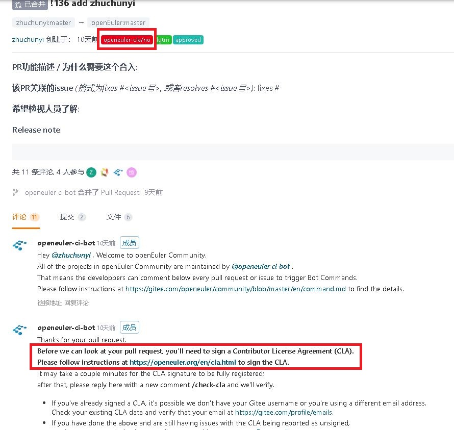
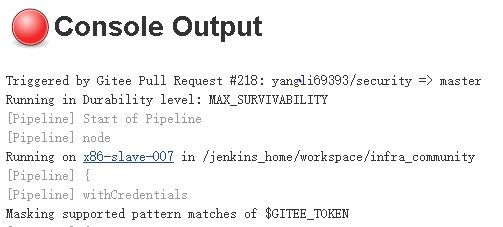
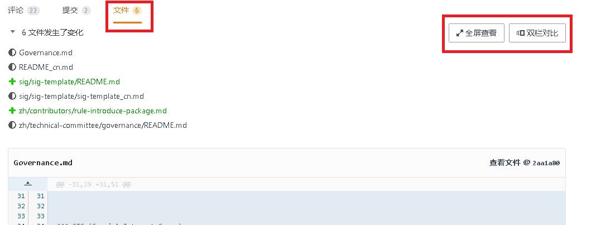

# PR提交指南

本指南确保您的PR请求符合我们的最佳实践。

## 在提交PR请求之前

提交PR是对项目上的master主干的一次合入申请，为保证合入的质量，这个动作是需要小心谨慎的。在您提交PR之前，请先完成本地验证，以便在一定程度上保证在提交PR后的持续集成测试的通过。由于不同的项目的本地验证方法不同，您可以参考[此章节内容](README.md/#参与编码贡献)以获取帮助。

## 提交PR

### 1、提交PR请求

如何在Gitee上提交PR的具体操作，请参考[Gitee工作流指导文档](Gitee-workflow.md)。为了更快的得到响应，您可以给PR添加标签，或提供更详细的信息，这里需要特别提示您的是：

- **关联Issue**：如果您提交的PR是针对某个Issue的，请您在提交的描述框内添加“#”字符，此时机器人会自动关联出当前存在的Issue，你可以通过此种方式快速的链接到关联的Issue。具体的操作指导请参考[此文档](https://gitee.com/help/articles/4142)。
- **标注优先级**：您可以在创建PR的时候，选择PR的优先级。或者在评论区通过`/priority high`给PR添加高优先级标签
- **标注是解决bug的合入**：您可以在描述框通过输入`/kind bug`来标注该PR是合入解决问题的代码，以便于大家更快的回应您的PR请求
- **标注所属sig**：为了方便查找，您也可以在描述框通过输入`sig sig-name`来标识该PR所属的sig。

### 2、分配评审人

您提交PR以后，社区机器人会自动给您分配评审人，您也可以指定评审人。指定评审人有两种方式，您可以在创建PR的时候，在右侧的下拉框中选择评审人。也可以在评论框中输入`/assign @reviewer`，从而把该PR分配给对应的人。如果您想把PR提交给项目的核心成员评审，以便于更快的获得批准，可以有两种方式获取到核心成员的信息：

- **方式一**：该Repository的`owners`文件（该文件通常在该repository的根目录下）中查看，此文件保存的是所有该Repository的评审人列表
- **方式二**：可以到该项目所属的SIG的首页内查看`README.md`文件，此文件会列出该sig的负责人，所有项目以及项目的负责人

## 自动化测试

- 如果您提交成功以后，看到PR上有`openeuler-cla/no`的标签，说明您还未和社区签署贡献者协议，请您先按照社区机器人的提示，完成贡献者协议的签署。

  

- 提交成功以后，社区机器人会启动自动化测试，**为了避免浪费评审人时间，通常只有自动化测试通过的PR，评审人才会参与评审**。您可以在PR的下方看到自动化测试的结果。

- 如果自动化测试失败，您可以通过“Build Details”查看失败的原因。

点击“Build Details”，可以看到具体的log信息。然后您可以在里面搜索“Error”，快速的定位到错误的信息。

- 修改后，您可以在评论框输入`/retest`命令，让社区机器人重新发起一次自动化测试。

## 审核PR

- 如果审核人通过您的提交，会在评论区添加`/lgtm`或者`/approve`，以表示对本次PR提交的认同

- 审核人可以在评论区发表意见，也可以在审核文件的时候，在发现问题处添加审核意见。无论哪种方式，都会在评论区显示出来。区别是，后者的评论会显示出“代码评论”，您可以通过“详情”查看评论具体指向的出处。

- 为了表示对评审人意见的尊重，如果对意见有异议，请您通过回复该意见来说明原因；如果接纳评审人意见，也请您做出简单的回应，便于确认后继的提交是否已按照所有接纳意见完成修改。

- 您也可以点击“文件”，直接在文件区查看具体的代码评审意见和对比结果。在此处，您也可以直接回复评审意见。

  

- 如果项目组的核心成员拒接了您的PR，会给出拒接意见。请不要气馁，您可以根据意见调整后继续和项目组成员沟通，相信在持之以恒的沟通调整后，您的能力和意见都会得到大家的认同。

- 请注意，在使用`/approve`前至少要有一个`/lgtm`

## 标记未完成的PR请求

如果您想在PR请求完成之前先征求大家的意见，有两种方法可以实现此目的：

1、您可以在评论区添加`hold`或`hold-cancel`标签

2、您可以在PR请求的标题中添加`WIP`或`[WIP]`前缀

当存在这两个标签时，将不会考虑合并你的PR请求。

## PR请求和发布周期

如果您的PR请求已经通过审核，但是一直未合入，则可能是由于当前版本的发布周期处于特定阶段造成的。有时版本致力于解决特定的问题或达成特定的目标，可能会冻结代码库的合入。**如果您认为此种状态不合理，可以联系对应的SIG/项目负责人或直接联系[sig-pm]()进行澄清**。

### 关于`Test-Ready`

组织成员可以将`test-ready`标签应用到贡献者提交的PR，以表明可以对该PR进行测试

## 命令参考

openEuler的机器人会将结构化标签运用于PR中。该机器人可以为您的PR过程提供一些有用的建议。为了方便查看，可以在注释中输入XXXXXXX选项，以触发自动标记和通知功能。请参阅[社区命令参考文档](./../sig-infrastructure/command.md)。
